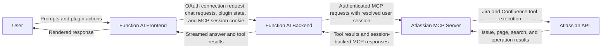

# Atlassian MCP Plugin Data Flow In Function AI

This document shows the high-level data flow for Atlassian MCP usage in Function AI.

## Data Flow Diagram

## Summary

- The frontend sends plugin connection requests and chat requests through the Function AI backend, along with plugin state and the MCP session cookie.
- The backend resolves the user session and forwards Atlassian MCP requests to the Atlassian MCP server.
- The Atlassian MCP server uses the authenticated user context to execute Jira and Confluence operations through Atlassian APIs.
- Tool results flow back through the backend to the frontend and then to the user.

## Sensitive Data Boundaries

- Raw Atlassian credentials are handled during the Atlassian authentication flow and then replaced in normal operation by a server-scoped MCP session cookie.
- Session continuity relies on the MCP session cookie and backend session resolution instead of re-sending raw credentials on each request.
- Jira and Confluence content returned by tools can flow back into backend processing, model context, and the user-visible response.
- Unlike the GitHub MCP plugin flow, this path does not require Azure Key Vault or encrypted PAT storage in the normal request flow.

## Practical Interpretation

- Read and write Atlassian actions both follow the same high-level path: frontend, backend, Atlassian MCP server, Atlassian API, then back.
- The main security boundary is the authenticated MCP service path, where per-user session context determines which Jira and Confluence tools and resources are available.
- The browser retains lightweight plugin state and the MCP session cookie, while Atlassian data exposure mainly occurs during tool execution and response generation.
*** End Patch