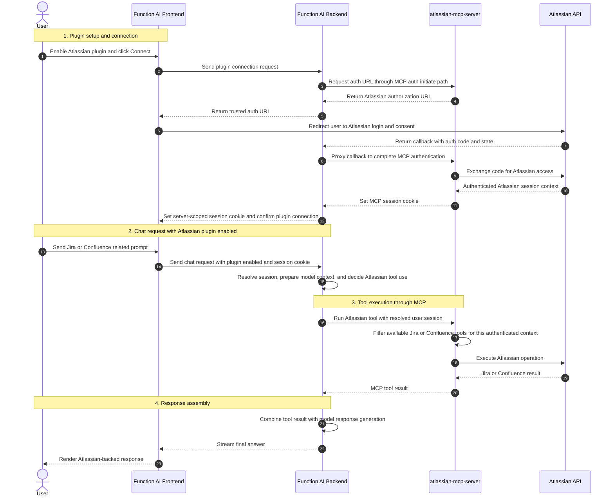

# Atlassian MCP Plugin Process Flow In Function AI

This document shows the high-level process flow for Atlassian MCP usage in Function AI.

## Process Flow Diagram

## Summary

- The frontend handles plugin enablement, OAuth initiation, chat input, and the MCP session cookie used for later Atlassian requests.
- The backend manages the MCP OAuth proxy flow, validates the returned auth URL, forwards the callback, renames the MCP cookie with the server ID, and coordinates Atlassian MCP execution.
- The Atlassian MCP server handles Atlassian authentication, exposes Jira and Confluence tools based on the authenticated context, executes Atlassian operations, and returns results to Function AI.
- Atlassian APIs provide the underlying Jira and Confluence data used during tool execution.

## Security Boundary

- This Function AI integration follows the generic OAuth-based MCP flow for non-PAT servers. Unlike the GitHub plugin flow, it does not depend on Azure Key Vault or backend PAT storage in the normal request path.
- After connection, the frontend and backend rely on a server-scoped MCP session cookie rather than re-sending raw Atlassian credentials on each request.
- The backend validates the returned authorization URL before redirecting the user and isolates MCP cookies by server name.
- Jira and Confluence data returned by tools can flow into backend response generation and the final user response.
*** End Patch